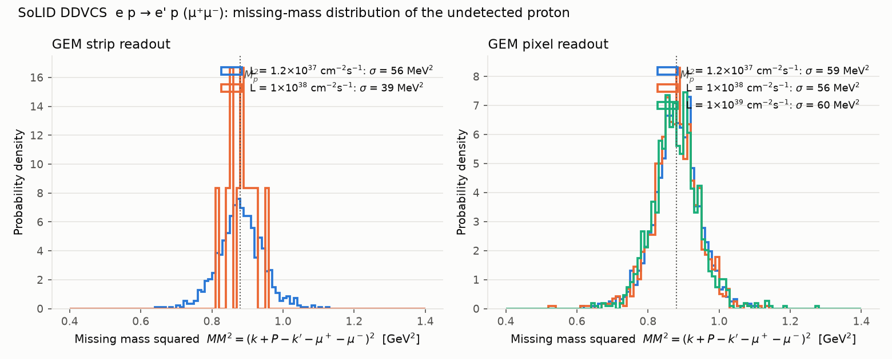
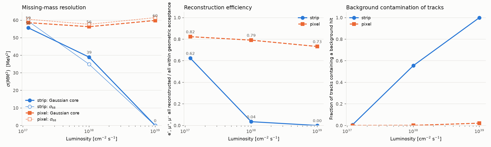

# DDVCS missing-mass resolution vs luminosity

Generated by `scripts/plot_ddvcs_results.py` from the fast-simulation + JANA2 reconstruction chain.

| L [cm⁻² s⁻¹] | GEM readout | events | geometric acceptance | ε(reco \| geom. acc) | ε(reco \| ≥4 GEM hits) | σ(MM²) core [MeV²] | σ₆₈(MM²) [MeV²] | ⟨MM²⟩ [GeV²] | σ(M_X) core [MeV] | σ(p)/p μ | tracks w/ bkg hit | fake tracks | GEM2 occupancy @Rin |
|---|---|---|---|---|---|---|---|---|---|---|---|---|---|
| 1.2e+37 | pixel | 10000 | 0.143 | 0.824 | 0.994 | 59 | 61 | 0.882 | 30.9 | 0.76% | 0.000 | 0.0000 | 0.000 |
| 1e+38 | pixel | 10000 | 0.143 | 0.791 | 0.988 | 56 | 58 | 0.879 | 29.9 | 0.74% | 0.001 | 0.0000 | 0.003 |
| 1e+39 | pixel | 10000 | 0.143 | 0.732 | 0.923 | 60 | 61 | 0.877 | 31.7 | 0.76% | 0.022 | 0.0047 | 0.030 |
| 1.2e+37 | strip | 10000 | 0.143 | 0.624 | 0.918 | 56 | 59 | 0.881 | 29.6 | 0.77% | 0.006 | 0.0001 | 0.145 |
| 1e+38 | strip | 2000 | 0.141 | 0.035 | 0.300 | 39 | 35 | 0.885 | 20.7 | 0.75% | 0.555 | 0.4417 | 1.209 |
| 1e+39 | strip | 2000 | 0.141 | 0.000 | 0.000 | 0 | 0 | 0.000 | 0.0 | 0.00% | 1.000 | 1.0000 | 12.094 |

## GEM background at the inner radius of each plane

| L | readout | plane | rate [kHz/mm²] | hits in 100 ns [1/cm²] | channel occupancy | hit survival |
|---|---|---|---|---|---|---|
| 1.2e+37 | pixel | 1 | 1.1 | 0.011 | 0.000 | 1.000 |
| 1.2e+37 | pixel | 2 | 3.6 | 0.036 | 0.000 | 0.999 |
| 1.2e+37 | pixel | 3 | 2.0 | 0.020 | 0.000 | 1.000 |
| 1.2e+37 | pixel | 4 | 0.9 | 0.009 | 0.000 | 1.000 |
| 1.2e+37 | pixel | 5 | 0.5 | 0.005 | 0.000 | 1.000 |
| 1.2e+37 | pixel | 6 | 0.2 | 0.002 | 0.000 | 1.000 |
| 1e+38 | pixel | 1 | 8.8 | 0.088 | 0.001 | 0.998 |
| 1e+38 | pixel | 2 | 30.2 | 0.302 | 0.003 | 0.994 |
| 1e+38 | pixel | 3 | 17.1 | 0.171 | 0.002 | 0.997 |
| 1e+38 | pixel | 4 | 7.8 | 0.078 | 0.001 | 0.998 |
| 1e+38 | pixel | 5 | 3.8 | 0.038 | 0.000 | 0.999 |
| 1e+38 | pixel | 6 | 1.9 | 0.019 | 0.000 | 1.000 |
| 1e+39 | pixel | 1 | 87.7 | 0.877 | 0.009 | 0.983 |
| 1e+39 | pixel | 2 | 302.3 | 3.023 | 0.030 | 0.941 |
| 1e+39 | pixel | 3 | 170.7 | 1.707 | 0.017 | 0.966 |
| 1e+39 | pixel | 4 | 78.1 | 0.781 | 0.008 | 0.984 |
| 1e+39 | pixel | 5 | 37.8 | 0.378 | 0.004 | 0.992 |
| 1e+39 | pixel | 6 | 19.0 | 0.190 | 0.002 | 0.996 |
| 1.2e+37 | strip | 1 | 1.1 | 0.011 | 0.040 | 0.922 |
| 1.2e+37 | strip | 2 | 3.6 | 0.036 | 0.145 | 0.748 |
| 1.2e+37 | strip | 3 | 2.0 | 0.020 | 0.082 | 0.849 |
| 1.2e+37 | strip | 4 | 0.9 | 0.009 | 0.037 | 0.928 |
| 1.2e+37 | strip | 5 | 0.5 | 0.005 | 0.010 | 0.980 |
| 1.2e+37 | strip | 6 | 0.2 | 0.002 | 0.006 | 0.988 |
| 1e+38 | strip | 1 | 8.8 | 0.088 | 0.337 | 0.510 |
| 1e+38 | strip | 2 | 30.2 | 0.302 | 1.209 | 0.089 |
| 1e+38 | strip | 3 | 17.1 | 0.171 | 0.683 | 0.255 |
| 1e+38 | strip | 4 | 7.8 | 0.078 | 0.312 | 0.535 |
| 1e+38 | strip | 5 | 3.8 | 0.038 | 0.086 | 0.842 |
| 1e+38 | strip | 6 | 1.9 | 0.019 | 0.052 | 0.900 |
| 1e+39 | strip | 1 | 87.7 | 0.877 | 3.366 | 0.001 |
| 1e+39 | strip | 2 | 302.3 | 3.023 | 12.094 | 0.000 |
| 1e+39 | strip | 3 | 170.7 | 1.707 | 6.827 | 0.000 |
| 1e+39 | strip | 4 | 78.1 | 0.781 | 3.125 | 0.002 |
| 1e+39 | strip | 5 | 37.8 | 0.378 | 0.862 | 0.178 |
| 1e+39 | strip | 6 | 19.0 | 0.190 | 0.524 | 0.351 |

