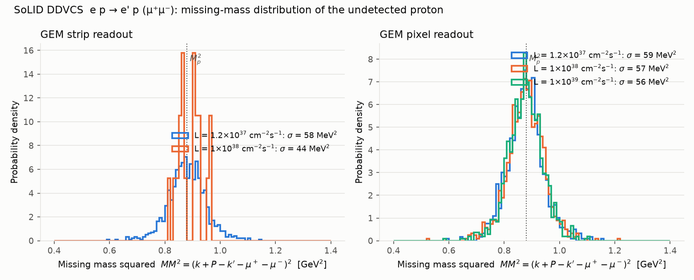
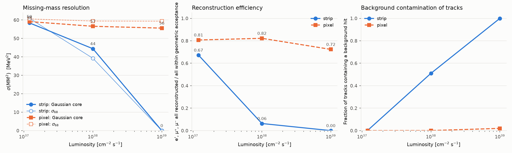

# DDVCS missing-mass resolution vs luminosity

Generated by `scripts/plot_ddvcs_results.py` from the fast-simulation + JANA2 reconstruction chain.

| L [cm⁻² s⁻¹] | GEM readout | events | geometric acceptance | ε(reco \| geom. acc) | ε(reco \| ≥4 GEM hits) | σ(MM²) core [MeV²] | σ₆₈(MM²) [MeV²] | ⟨MM²⟩ [GeV²] | σ(M_X) core [MeV] | σ(p)/p μ | tracks w/ bkg hit | fake tracks | GEM2 occupancy @Rin |
|---|---|---|---|---|---|---|---|---|---|---|---|---|---|
| 1.2e+37 | pixel | 10000 | 0.143 | 0.807 | 0.993 | 59 | 61 | 0.875 | 31.1 | 0.76% | 0.000 | 0.0000 | 0.000 |
| 1e+38 | pixel | 10000 | 0.143 | 0.822 | 0.990 | 57 | 59 | 0.881 | 30.5 | 0.77% | 0.001 | 0.0000 | 0.001 |
| 1e+39 | pixel | 10000 | 0.142 | 0.724 | 0.929 | 56 | 59 | 0.878 | 29.8 | 0.77% | 0.020 | 0.0031 | 0.010 |
| 1.2e+37 | strip | 10000 | 0.143 | 0.672 | 0.982 | 58 | 61 | 0.881 | 31.2 | 0.77% | 0.001 | 0.0000 | 0.050 |
| 1e+38 | strip | 2000 | 0.142 | 0.063 | 0.311 | 44 | 39 | 0.892 | 23.5 | 0.82% | 0.511 | 0.3971 | 0.414 |
| 1e+39 | strip | 2000 | 0.141 | 0.000 | 0.000 | 0 | 0 | 0.000 | 0.0 | 0.00% | 1.000 | 1.0000 | 4.143 |

## GEM background at the inner radius of each plane

| L | readout | plane | rate [kHz/mm²] | hits in 100 ns [1/cm²] | channel occupancy | hit survival |
|---|---|---|---|---|---|---|
| 1.2e+37 | pixel | 1 | 0.8 | 0.008 | 0.000 | 1.000 |
| 1.2e+37 | pixel | 2 | 1.2 | 0.012 | 0.000 | 1.000 |
| 1.2e+37 | pixel | 3 | 0.8 | 0.008 | 0.000 | 1.000 |
| 1.2e+37 | pixel | 4 | 0.4 | 0.004 | 0.000 | 1.000 |
| 1.2e+37 | pixel | 5 | 0.2 | 0.002 | 0.000 | 1.000 |
| 1.2e+37 | pixel | 6 | 0.1 | 0.001 | 0.000 | 1.000 |
| 1e+38 | pixel | 1 | 7.1 | 0.071 | 0.001 | 0.999 |
| 1e+38 | pixel | 2 | 10.4 | 0.104 | 0.001 | 0.998 |
| 1e+38 | pixel | 3 | 6.4 | 0.064 | 0.001 | 0.999 |
| 1e+38 | pixel | 4 | 3.5 | 0.035 | 0.000 | 0.999 |
| 1e+38 | pixel | 5 | 1.8 | 0.018 | 0.000 | 1.000 |
| 1e+38 | pixel | 6 | 1.1 | 0.011 | 0.000 | 1.000 |
| 1e+39 | pixel | 1 | 70.8 | 0.708 | 0.007 | 0.986 |
| 1e+39 | pixel | 2 | 103.6 | 1.036 | 0.010 | 0.979 |
| 1e+39 | pixel | 3 | 64.5 | 0.645 | 0.006 | 0.987 |
| 1e+39 | pixel | 4 | 35.2 | 0.352 | 0.004 | 0.993 |
| 1e+39 | pixel | 5 | 17.7 | 0.177 | 0.002 | 0.996 |
| 1e+39 | pixel | 6 | 10.9 | 0.109 | 0.001 | 0.998 |
| 1.2e+37 | strip | 1 | 0.8 | 0.008 | 0.033 | 0.937 |
| 1.2e+37 | strip | 2 | 1.2 | 0.012 | 0.050 | 0.905 |
| 1.2e+37 | strip | 3 | 0.8 | 0.008 | 0.031 | 0.940 |
| 1.2e+37 | strip | 4 | 0.4 | 0.004 | 0.017 | 0.967 |
| 1.2e+37 | strip | 5 | 0.2 | 0.002 | 0.005 | 0.990 |
| 1.2e+37 | strip | 6 | 0.1 | 0.001 | 0.004 | 0.993 |
| 1e+38 | strip | 1 | 7.1 | 0.071 | 0.272 | 0.580 |
| 1e+38 | strip | 2 | 10.4 | 0.104 | 0.414 | 0.437 |
| 1e+38 | strip | 3 | 6.4 | 0.064 | 0.258 | 0.597 |
| 1e+38 | strip | 4 | 3.5 | 0.035 | 0.141 | 0.755 |
| 1e+38 | strip | 5 | 1.8 | 0.018 | 0.040 | 0.923 |
| 1e+38 | strip | 6 | 1.1 | 0.011 | 0.030 | 0.942 |
| 1e+39 | strip | 1 | 70.8 | 0.708 | 2.720 | 0.004 |
| 1e+39 | strip | 2 | 103.6 | 1.036 | 4.143 | 0.000 |
| 1e+39 | strip | 3 | 64.5 | 0.645 | 2.578 | 0.006 |
| 1e+39 | strip | 4 | 35.2 | 0.352 | 1.407 | 0.060 |
| 1e+39 | strip | 5 | 17.7 | 0.177 | 0.403 | 0.447 |
| 1e+39 | strip | 6 | 10.9 | 0.109 | 0.301 | 0.547 |

